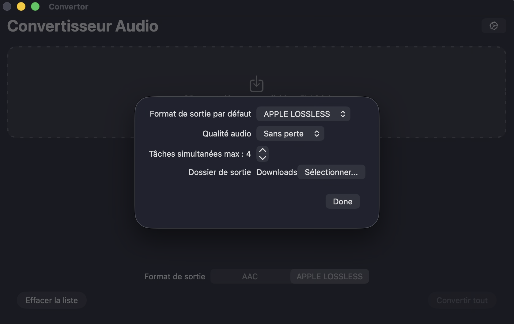

media-convertor/README.md#L1-200
# Convertor

Media file converter for macOS.

This application allows you to convert your audio (FLAC) and video (MKV, MP4) files to Apple-compatible formats (AAC/ALAC for audio, MP4 for video). It's a powerful and efficient tool for preparing your media files for your Apple devices, with hardware acceleration for fast conversions.

## Features

### Audio Conversion
- Convert FLAC files to AAC or Apple Lossless (ALAC).
- Customizable audio bitrate (256k or 320k).
- Preserves metadata (including album art).

### Video Conversion
- Convert MKV, MP4, and WebM files to MP4 format.
- Hardware-accelerated encoding using VideoToolbox (H.264/H.265).
- Customizable video codec (H.264 or H.265 HEVC).
- Adjustable resolution (720p, 1080p, 4K).
- Custom video bitrate or quality presets (1-6 Mbps).
- Adaptive bitrate to fit maximum file size.
- Audio language selection.
- Subtitle language selection and embedding.

### General Features
- Drag and drop files or select them through a file dialog.
- Concurrent conversions to speed up the process.
- Progress indicators for each conversion.
- Cancellation of individual or all conversions.
- Per-file settings customization.
- Notifications on conversion completion.
- English and French localization.

## Requirements

- macOS 13.0 or later (for VideoToolbox hardware acceleration)
- Xcode (for building)

## How to Build

1.  Clone the repository.
2.  Open `Convertor.xcodeproj` in Xcode.
3.  Select the `Convertor` scheme.
4.  Build and run the application.

## Architecture

The application is built using SwiftUI for the user interface and follows the MVVM (Model-View-ViewModel) architecture pattern.

### Key Components

- **ContentView**: Main view handling the UI, drag-and-drop, and file list.
- **ConvertorViewModel**: Manages the application state, conversion queue, and business logic.
- **ConversionService**: Handles the actual media conversion using FFmpeg.
- **MediaInfoService**: Extracts metadata from media files (audio/subtitle tracks).
- **Settings**: Manages user preferences and defaults.

### Conversion Process

1. Files are added via drag-and-drop or file picker.
2. Media type is detected based on file extension.
3. For videos, FFmpeg is used to extract available audio and subtitle tracks.
4. Conversions are queued and processed concurrently (up to a configurable limit).
5. Progress is tracked in real-time by parsing FFmpeg's stderr output.
6. Completed files are saved to the specified output directory.

## Technical Details

- **FFmpeg Integration**: The app bundles a static FFmpeg binary for media processing.
- **Hardware Acceleration**: Uses VideoToolbox on Apple Silicon for H.264/H.265 encoding.
- **Concurrency**: Utilizes Combine framework for reactive programming and async/await for conversions.
- **Security**: Implements security-scoped bookmarks for accessing user-selected directories.
- **Localization**: Supports English and French with String Catalog.

## Dependencies

- FFmpeg (bundled in Resources/ffmpeg)
- SwiftUI
- Combine
- AVFoundation (for media type detection)

## Screenshots

## License

This project is licensed under the MIT License - see the [LICENSE](LICENSE) file for details.

---

# Convertor (Français)

Convertisseur de fichiers multimédia pour macOS.

Cette application vous permet de convertir vos fichiers audio (FLAC) et vidéo (MKV, MP4) vers des formats compatibles Apple (AAC/ALAC pour l'audio, MP4 pour la vidéo). C'est un outil puissant et efficace pour préparer vos fichiers multimédia pour vos appareils Apple, avec accélération matérielle pour des conversions rapides.

## Fonctionnalités

### Conversion Audio
- Conversion des fichiers FLAC en AAC ou Apple Lossless (ALAC).
- Débit audio personnalisable (256k ou 320k).
- Préserve les métadonnées (y compris les pochettes d'album).

### Conversion Vidéo
- Conversion des fichiers MKV, MP4 et WebM vers le format MP4.
- Encodage accéléré matériellement utilisant VideoToolbox (H.264/H.265).
- Codec vidéo personnalisable (H.264 ou H.265 HEVC).
- Résolution ajustable (720p, 1080p, 4K).
- Débit vidéo personnalisé ou préréglages de qualité (1-6 Mbps).
- Débit adaptatif pour respecter la taille maximale du fichier.
- Sélection de la langue audio.
- Sélection et incorporation des sous-titres.

### Fonctionnalités Générales
- Glisser-déposer les fichiers ou les sélectionner via une boîte de dialogue.
- Conversions simultanées pour accélérer le processus.
- Indicateurs de progression pour chaque conversion.
- Annulation des conversions individuelles ou de toutes les conversions.
- Personnalisation des paramètres par fichier.
- Notifications à la fin des conversions.
- Localisation en anglais et en français.

## Prérequis

- macOS 13.0 ou ultérieur (pour l'accélération matérielle VideoToolbox)
- Xcode (pour la compilation)

## Comment compiler

1.  Clonez le dépôt.
2.  Ouvrez `Convertor.xcodeproj` dans Xcode.
3.  Sélectionnez le schéma `Convertor`.
4.  Compilez et exécutez l'application.

## Architecture

L'application est construite en utilisant SwiftUI pour l'interface utilisateur et suit le modèle d'architecture MVVM (Modèle-Vue-ViewModel).

### Composants Clés

- **ContentView** : Vue principale gérant l'interface utilisateur, le glisser-déposer et la liste des fichiers.
- **ConvertorViewModel** : Gère l'état de l'application, la file d'attente de conversion et la logique métier.
- **ConversionService** : Gère la conversion réelle des médias en utilisant FFmpeg.
- **MediaInfoService** : Extrait les métadonnées des fichiers médias (pistes audio/sous-titres).
- **Settings** : Gère les préférences utilisateur et les valeurs par défaut.

### Processus de Conversion

1. Les fichiers sont ajoutés via glisser-déposer ou sélecteur de fichiers.
2. Le type de média est détecté en fonction de l'extension du fichier.
3. Pour les vidéos, FFmpeg est utilisé pour extraire les pistes audio et sous-titres disponibles.
4. Les conversions sont mises en file d'attente et traitées simultanément (jusqu'à une limite configurable).
5. La progression est suivie en temps réel en analysant la sortie stderr de FFmpeg.
6. Les fichiers terminés sont sauvegardés dans le répertoire de sortie spécifié.

## Détails Techniques

- **Intégration FFmpeg** : L'application inclut un binaire FFmpeg statique pour le traitement des médias.
- **Accélération Matérielle** : Utilise VideoToolbox sur Apple Silicon pour l'encodage H.264/H.265.
- **Concurrence** : Utilise le framework Combine pour la programmation réactive et async/await pour les conversions.
- **Sécurité** : Implémente des signets de sécurité pour accéder aux répertoires sélectionnés par l'utilisateur.
- **Localisation** : Prend en charge l'anglais et le français avec String Catalog.

## Dépendances

- FFmpeg (inclus dans Resources/ffmpeg)
- SwiftUI
- Combine
- AVFoundation (pour la détection du type de média)

## Captures d'écran

## Licence

Ce projet est sous licence MIT - voir le fichier [LICENSE](LICENSE) pour plus de détails.